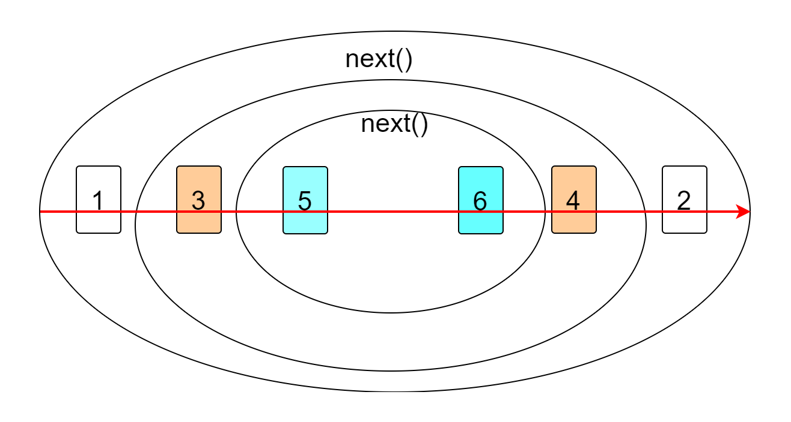

# koa

koa是对http的一个封装，实现了一个Node框架  => 根据这个框架去实现自己的mvc框架
由于每个人对koa的方式都不太一样，无法做到约定性，因此出现了egg.js。

lib
* application.js  创建应用
* context 上下文
* request koa中自己实现的request对象
* response koa中自己实现的response对象


## koa的基本使用
```js
const Koa = require("koa");
const app = new Koa();
app.use(async (ctx,next) => {
    throw new Error("监听错误");
    ctx.body = "hello,world";
})
app.on("error",(err) => {
    console.log(err);
})
app.listen(3000,() => {
    console.log(`server is running in port 3000`);
})
```

## 实现一个简易的Koa

根据上面的使用，我们知道koa实际上是一个类，这个类有`use`,`listen`方法，同时他还可以使用`on`监听`error`事件，
说明它继承了`events`类。

### 步骤一：实现基本的逻辑
```js
const EventEmitter = require("events");
const http = require("http");
class Application extends EventEmitter {
    use(callback) {
        this.callback = callback;
    }
    // 每个请求
    handleRequest(req,res) {
      this.callback(req,res);
    }
    listen(...args) {
        let server = http.createServer(this.handleRequest.bind(this));
        server.listen(...args);
    }

}
```

### 步骤二：属性的扩展ctx.request
`context`是koa自己封装的上下文对象，整合了自己实现的request和response，以及原生的req和res。
以url为例，在ctx中存在原生的url，即
```js
console.log(ctx.req.url);
console.log(ctx.request.req.url);
```
也存在封装后的url:
```js
console.log(ctx.request.url);
console.log(ctx.url); // ctx.url实际上是从ctx.request.url
```
我们可以发现无论是`context`还是`request`还是`response`都是一个对象，封装了一些属性而已。

```js
    createContext(req,res){
        // 每次请求都创建全新的上下文，防止多个请求之间共享数据
        let context = Object.create(this.context);
        let request = Object.create(this.request);
        let response = Object.create(this.response);
        // 上下文中有一个req属性是原生的req属性
        context.req = req;
        // 上下文中有一个request对象，是自己封装的对象
        context.request = request;
        // 自己封装的request对象上有req属性
        context.request.req = req;
        return context;
    }
```
如上所示，我们在`context`上新增了`req`属性，新增了`request`属性等。这样的话，我们如果再在`request`身上绑定其他属性，
那么都可以通过`ctx.request`获取到。
```js
const request = {
  get url(){
      // 属性访问器  ctx.request.url   
    //   console.log(this)  // 这里的this是ctx.request
      return this.req.url;
  },
  get path(){
      return url.parse(this.req.url).pathname;
  },
  get query(){
    console.log("req.url11111:",this.req.url)
    return url.parse(this.req.url).query;
  }
}
```
### 步骤三：context的实现原理

#### 实现ctx.req
我们经常使用`ctx.url`这种直接从`context`中去获取`url`，而不是通过`ctx.request.url`去获取。
实际上内部只是做了一次代理罢了。内部还是需要通过`ctx.request.xxx`去进行获取
```js
const context = {
   get url(){
       // ctx.url
       return this.request.url;
   },
   get path(){
       return this.request.path;
   },
   get query(){
       return this.request.query;
   }
}
```
进一步优化，我们可以发现最终`ctx`身上的属性，都是通过`this.request.xxx`来进行获取，如果需要绑定的属性比较多，那么重复度就比较高，因此我们直接实现这个拦截方法。
```js
const context = {}
function defineGetter(target,key){
  context.__defineGetter__(key,function(){
      return this[target][key];
  })
}
defineGetter("request","url");  // ctx.url => ctx.request.url
defineGetter("request","path");  
defineGetter("request","query");  

```

#### 实现ctx.res
对于`response`我们经常需要处理它的响应，比如`ctx.body="111"`，同时我们需要能够读取`ctx.body`。
```js
const response = {
  _body:"",
  get body(){
    return this._body;
  },
  set body(newBody){  // ctx.body = newBody;
    console.log("newBody:",newBody)
    this._body = newBody;
  }
}
module.exports = response;
```
1. 实现读取`ctx.body`
```js
function defineGetter(target,key){
  context.__defineGetter__(key,function(){
      return this[target][key];
  })
}
defineGetter("response","body");  
```
2. 实现设置`ctx.body`
```js
function defineSetter(target, key) {
    context.__defineSetter__(key, function (value) {
        this[target][key] = value;
    })
}
defineSetter("response", "body");
```

## koa的中间件原理

### koa中间件的使用
koa中间件的使用，最重要的是理解它的洋葱模型。示例：
```js
app.use( async(ctx,next) => {
    console.log(1);
    next();
    console.log(2)
})

app.use(async (ctx, next) => {
    console.log(3);
    next();
    console.log(4)
})


app.use(async (ctx, next) => {
    console.log(5);
    next();
    console.log(6)
})
```
上面的代码，用一个洋葱模型来描述就是如下图所示：
;
洋葱模型中next表示执行下一个中间件。因此，上面代码的执行顺序是：
1. 执行`console.log(1)`
2. 执行next(),由于执行next实际上就是执行下一个中间件。也就是执行下一个函数
```js
(ctx, next) => {
    console.log(3);
    next();
    console.log(4)
}
```
3. 下一个函数，先输出3，然后又执行了next，因此会继续执行下一个中间件函数。
```js
(ctx, next) => {
    console.log(5);
    next();
    console.log(6)
}
```
4. 下一个中间件函数，先输出5，然后执行next，由于没有其他的中间件了，因此直接往下执行，输出6。到此为止，最后一个中间件执行完毕，表示第二个中间件的next函数执行完毕，执行后面的输出4。然后执行完毕，
执行后面的输出6。因此，最终的顺序是1，3,5,6,4,2。

上面的代码中，我们没有使用`await`进行等待，如果使用了`await`结果可能就不是按照我们想象的顺序执行。因为await后面的都是微任务，需要等到同步任务执行完毕才能执行，比如我们给第二个中间件使用了`await`
### koa中间件使用async和await
```js
app.use( async(ctx,next) => {
    console.log(1);
    next();
    console.log(2)
})

app.use(async (ctx, next) => {
    console.log(3);
    await next();
    console.log(4)
})


app.use(async (ctx, next) => {
    console.log(5);
    next();
    console.log(6)
})
```
如上代码所示，我们给第二个中间件使用了await，这样的话它执行的顺序就是：1,3,5,6,2,4。它的执行过程如下：
1. 先输出1
2. 第一个中间件的next执行，那么就会执行第二个中间件。首先输出3，
然后碰到`await next()`;那么它会进行两步操作，一：执行next函数；二：将`await next()`后面的代码都放到微任务中去。这样的话执行顺序就是：
3. 第三个中间件执行分别输出5和6。这时候会查看发现有同步任务，那么就会先输出2，然后再执行异步任务，输出4。

**总结：**
koa的中间件原理：将所有的中间件，组合成一个大的promise，当这个promise执行完毕后，会采用当前的ctx.body进行结果的响应，(**next前面必须有await 或者return 否则执行顺序可能达不到预期**)。注意：响应的永远是第一个的中间件的结果(因为其他的中间件其实都是包裹在第一个中间件中的)。
1. 如果都是同步逻辑，加不加await无所谓
2. 如果可能存在异步逻辑，那么都加上await。

#### next的功能：
1. 可以把多个模块通过next方法连接起来
2. 可以决定是否向下执行（可以实现后台权限）

```js
app.use( async(ctx,next) => {
    console.log(1);
    await next();
    console.log(2)
})

app.use(async (ctx, next) => {
    console.log(3);
    // await next();   这里没有调用next
    // console.log(4)
})
app.use(async (ctx, next) => {
    console.log(5);
    await next();
    console.log(6)
})
```
我们可以看到第二个中间件没有调用next，最终得到的结果是：1,3,2，也就是后面的中间件函数没有执行了。
3. 可以封装一些方法，在中间件中，封装后向下执行。
```js

app.use( async(ctx,next) => {
    console.log(1);
    ctx.name = "hello,world";  // 封装了name属性
    await next();
    console.log(2)
})

app.use(async (ctx, next) => {
    console.log(3);
    console.log(ctx.name)    // 在后面的中间件中获取到这个属性
    await next();
    console.log(4)
})
```
我们在第一个中间件中封装了`ctx.name`，在后面的中间件中可以获取到这个属性，从而进行使用。
